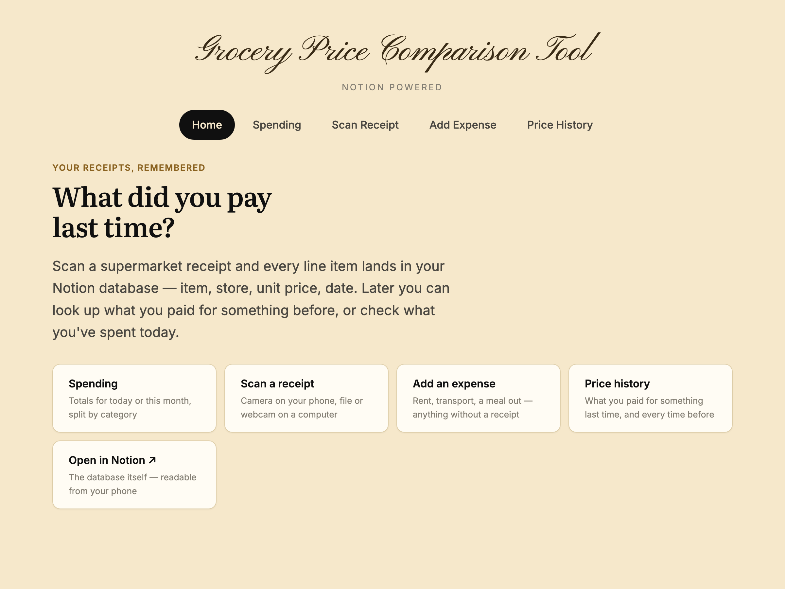
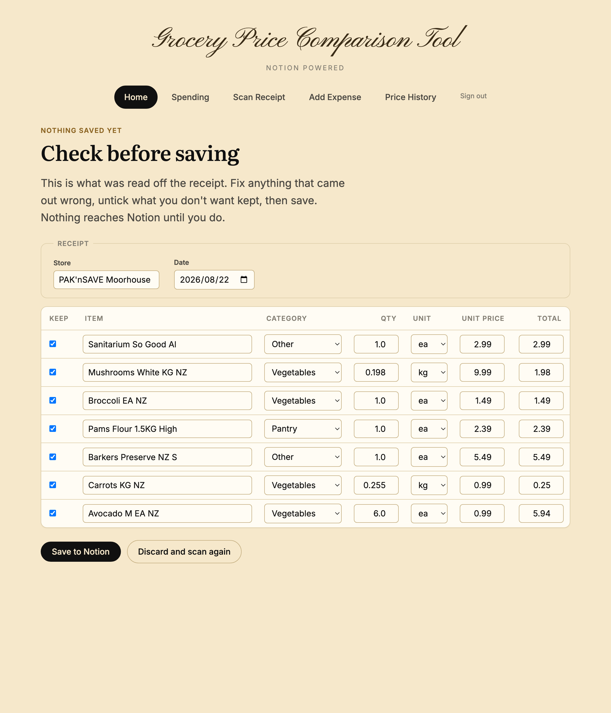
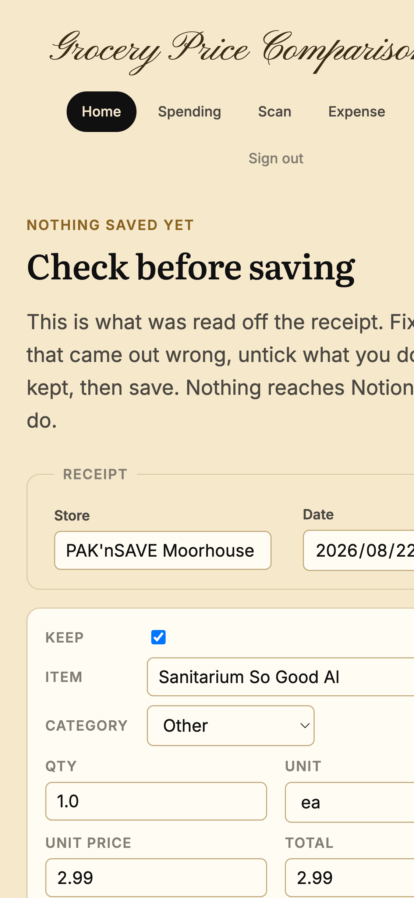
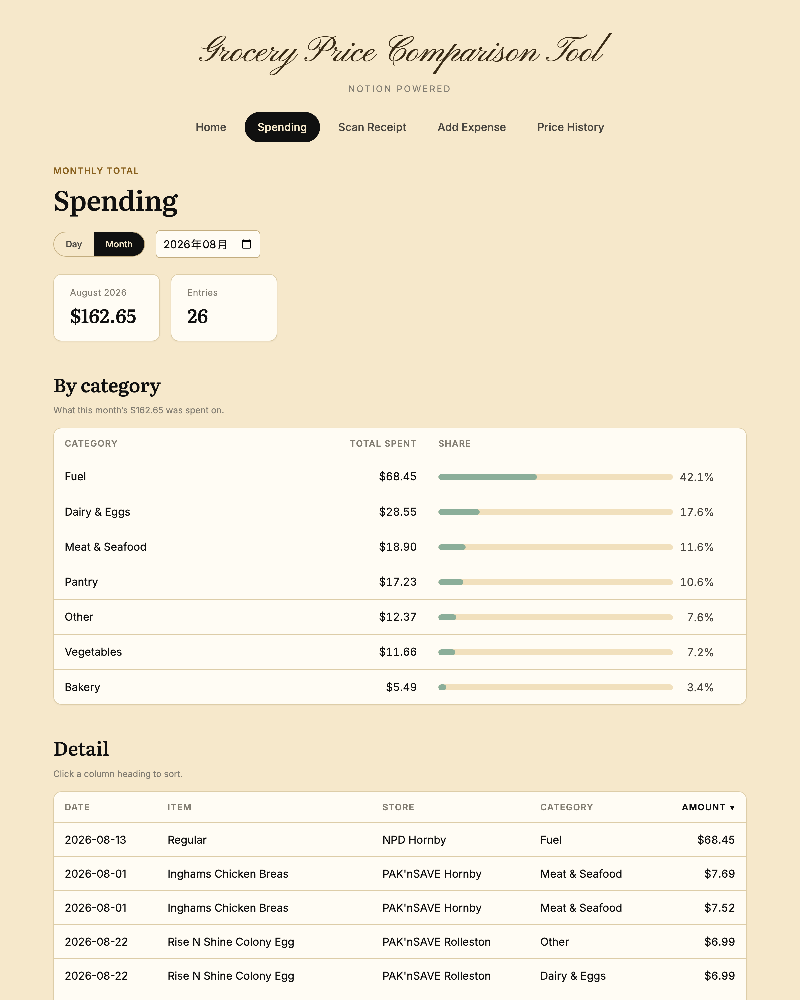
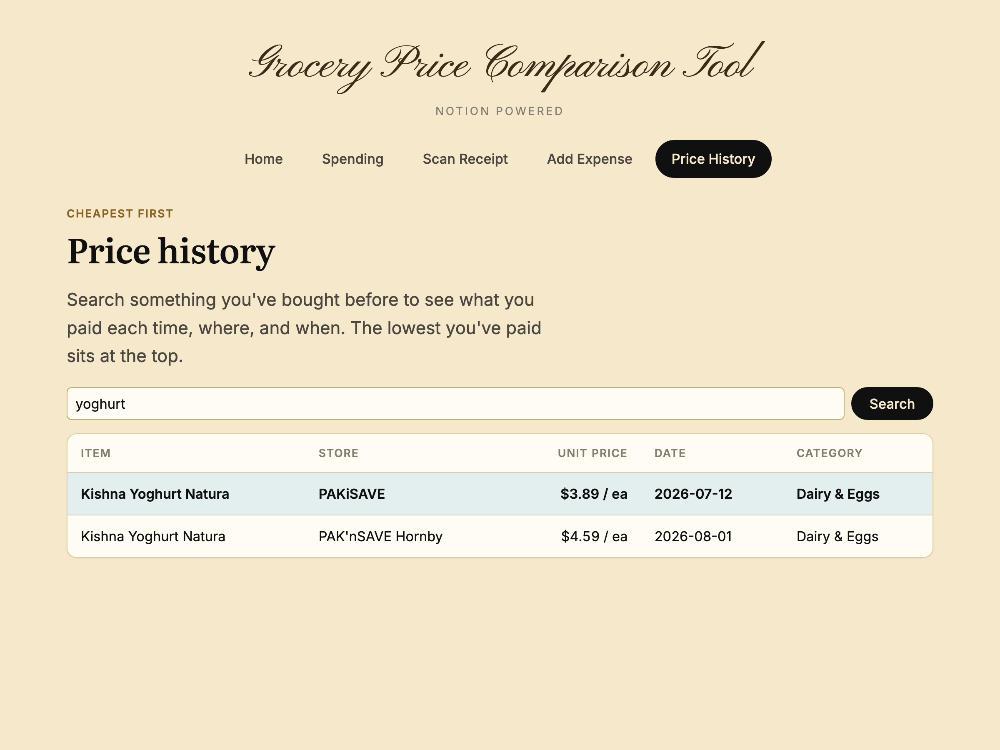
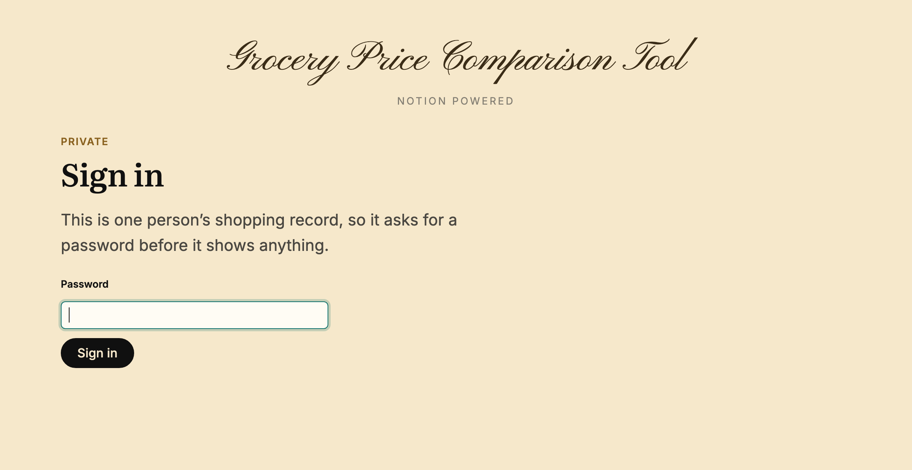

# Grocery Price Tool (Notion-backed)

A small Flask app that scans a NZ supermarket receipt and logs every item's
price into a Notion database, so you can answer a question no shop can
answer for you: **what did I actually pay for this last time?**

It isn't a price-comparison service. [Grocer](https://grocer.nz) already does
that well for New Zealand, and it knows today's shelf prices across chains,
which this never will. What Grocer can't tell you is what *you* paid — at the
produce shop that publishes nothing, on the day you happened to buy it,
before the price crept up. That's your own receipts, and nobody else has them.

Take a photo on your phone (or upload one from your computer). OCR reads the
text off the receipt, layout-aware parsing pulls out the store, date, line
items and prices, you check the result on screen, and each item becomes a new
row in a Notion database via the [Notion API](https://developers.notion.com/).
Notion is the only datastore — there's no second database to keep in step,
and the same records open in the Notion app on your phone.



## Why build this this way?

This is a companion piece to a separate [receipt-tracker](../receipt-tracker)
project, which does the same receipt-scanning idea with its own PostgreSQL
database and custom dashboard pages. This project asks a different question:
what if Notion itself — its filtering, sorting, and grouping — *is* the
dashboard? Every scanned item becomes a page in a Notion database, so
"everything I've bought called milk" is a filter, and the history is
readable in the Notion app without this app running at all.

## Nothing is saved until you say so

OCR gets something wrong on most receipts, and hunting those mistakes down in
Notion afterwards is worse than fixing them while the receipt is still in your
hand. So a scan lands on a check screen first: every field is editable, each
row can be dropped, and nothing is written until you press save.



This is the screen that has to work on a phone, since it is what you look at
standing in the shop. Seven columns do not fit a 375px window — the prices you
are meant to be checking end up scrolled off the right-hand side, with nothing
on screen to say they are there — so on a narrow screen each row becomes a
card instead, with every field visible and named.



## How the OCR works

`groceryapp/ocr.py` (shared with the receipt-tracker project) picks between
three engines, in preference order:

1. **macOS Vision** — the framework behind Live Text. Free, local, and the
   most accurate of the three. Used whenever it's available.
2. **Google Cloud Vision** — used when `GOOGLE_VISION_API_KEY` is set, which
   is what runs when the app is hosted on Linux and Apple's framework isn't
   there.
3. **Tesseract** — a last resort needing no key and no network, but it misses
   most prices on a real receipt.

The gap between them is not small. On a real phone photo of a curved
thermal receipt, Tesseract read the item names but **not a single price**;
Vision read every price at full confidence:

| | Tesseract | macOS Vision |
|---|---|---|
| `BROCCOLI 2 FOR` | name only | ✅ with `$3.00` |
| `0.840 kg @ $8.99/kg` | `0.840 Kg &` | ✅ complete |
| `$7.55`, `$1.55`, `$12.10`, `$1.58` | ❌ none found | ✅ all, confidence 1.00 |
| `TOTAL` | read as `TO: LAL` | ✅ with `$12.10` |

Preprocessing didn't close that gap — greyscale, upscaling, contrast
stretching, sharpening, and binarisation all made Tesseract's output *worse*
on this image, not better.

**Parsing works off layout, not string shape.** Both engines return text
along with where it sits on the page, so the parser groups text into visual
rows by vertical position, then reads the rightmost price-shaped run in each
row as the amount and whatever is to its left as the item. This handles the
two-line format NZ produce shops use, where the item name is on one line and
its weight and price land on the next:

```
Kiwifruit Gold
    0.840 kg @ $8.99/kg          $7.55
```

Two details that cost real debugging time, both worth knowing about:

- Phone photos carry an **EXIF orientation** tag, and neither engine applies
  it for you. Left uncorrected, Tesseract reads sideways text (and returns
  nothing usable) while Vision returns coordinates with the axes effectively
  swapped, which silently collapses every row together.
- OCR can split a number across a space (`$8. 99`), so numeric parsing has to
  tolerate that rather than stopping at the first space.

A third detail worth knowing: receipts print things beside the price that
aren't the price. Pak'nSave marks GST-applicable lines with `*`, New World
prints a single-letter tax code (`$3.99 C`), and a pattern that insisted the
amount ended the line silently dropped those items altogether.

Category assignment is a keyword dictionary (`"milk"` → Dairy & Eggs) with no
real language understanding behind it, so unusual products land in `Other`.
One category is decided by the shop instead: a fuel pump prints its grade as
`Regular`, and "regular" turns up in enough grocery names that a keyword would
misfile them, so the grade names count only on a receipt from a fuel retailer.

## Features

- **Scan a receipt** — on mobile, the file input opens the camera directly;
  on desktop, pick a file or capture a frame from the webcam.
- **Check before saving** — correct anything OCR got wrong, drop rows you
  don't want, then write the lot to Notion in one go.
- **Spending** — total spent today or this month, split by category, with
  the entries behind it sortable by any column.
- **Manual expenses** — record spending that never had a supermarket
  receipt (rent, transport, a meal out) into the same database, so the
  totals cover everything.
- **Price history** — search an item name and see every time you've bought
  it: what you paid, where, and when. Sorted cheapest first, so the lowest
  you've ever paid is the line to beat.





Because Notion holds the data, the same records are readable from the
Notion app on your phone — which is what you actually want standing in a
supermarket aisle, with the laptop at home.

## Signing in

The app holds one person's shopping record and carries the Notion credentials
that can write to it, so it is locked behind a password. There is no sign-up
and no user table: one password, checked against a hash in the environment.

The guard is a `before_request` hook rather than a decorator on each route, so
a page added later is protected by default instead of protected only if
someone remembers to decorate it.



## Getting this running

1. **Install Tesseract** — the fallback OCR engine. On macOS this is optional
   (Vision is built into the OS and will be used instead), but installing it
   means the app still works if Vision ever fails on an image. Off macOS it's
   required.

   ```bash
   brew install tesseract
   ```

2. **Create a virtual environment and install dependencies**

   ```bash
   python3 -m venv .venv
   source .venv/bin/activate
   pip install -r requirements.txt
   ```

3. **Set up a Notion integration**

   - Go to [notion.so/my-integrations](https://www.notion.so/my-integrations)
     and create a new integration. Copy its "Internal Integration Secret".
   - In your Notion workspace, create (or pick) a page, then use its
     **Share** menu to invite your new integration — Notion won't let the
     API touch anything you haven't explicitly shared.
   - Copy that page's ID (the 32-character string in its URL).

4. **Set up your environment variables**

   ```bash
   cp .env.example .env
   ```

   Fill in `NOTION_API_KEY` (the integration secret) and
   `NOTION_PARENT_PAGE_ID` (the page you shared in step 3). Leave
   `NOTION_DATABASE_ID` blank for now — the next step fills it in.
   Also set `FLASK_SECRET_KEY` to any random string.

5. **Create the Notion database**

   ```bash
   python setup_notion.py
   ```

   This creates a "Grocery Prices" database under your parent page and
   prints its ID. Paste that into `.env` as `NOTION_DATABASE_ID`.

6. **Set a password**

   ```bash
   python set_password.py
   ```

   Type a password twice and paste the `APP_PASSWORD_HASH=` line it prints
   into `.env`. Only the hash is stored, never the password. Without this the
   app refuses every login rather than letting anyone in.

7. **Run it**

   ```bash
   python run.py
   ```

   Visit `http://127.0.0.1:5000`. To scan from your phone, both devices need
   to be on the same Wi-Fi network — `127.0.0.1` means "this machine", so from
   the phone you visit the computer's LAN IP instead (`ipconfig getifaddr en0`
   on macOS). The dev server already binds to `0.0.0.0` so it accepts those
   connections.

## Project structure

```
groceryapp/
├── __init__.py             # creates the Flask app, loads .env
├── auth.py                 # password gate: /login, /logout, before_request guard
├── ocr.py                  # OCR engines + layout-aware parsing (shared with receipt-tracker)
├── notion_sync.py          # reads and writes the Notion database
├── routes.py               # / , /spending , /expense , /upload , /confirm , /compare
├── templates/
└── static/
setup_notion.py             # one-off: creates the Notion database, prints its ID
set_password.py             # prints the APP_PASSWORD_HASH line for .env
migrate_categories.py       # one-off: re-files rows after a category change
tidy_item_names.py          # one-off: softens receipt capitals in existing rows
remove_duplicate_scans.py   # one-off: archives a receipt scanned in twice
```

The one-off scripts all print their plan and change nothing without `--apply`.

## Not in this version

- No receipt photos are kept — the uploaded image is OCR'd from a temp file
  and deleted immediately after.
- No demo mode. The app reads and writes one personal Notion database, so
  sharing it with someone means a second database and a second password.
- No LLM-based extraction. Handing the photo to a vision-capable model would
  likely beat the keyword categoriser and cope better with unusual receipt
  layouts, but it needs an API key and costs money per scan — the whole point
  of the current setup is that it's free and offline.
